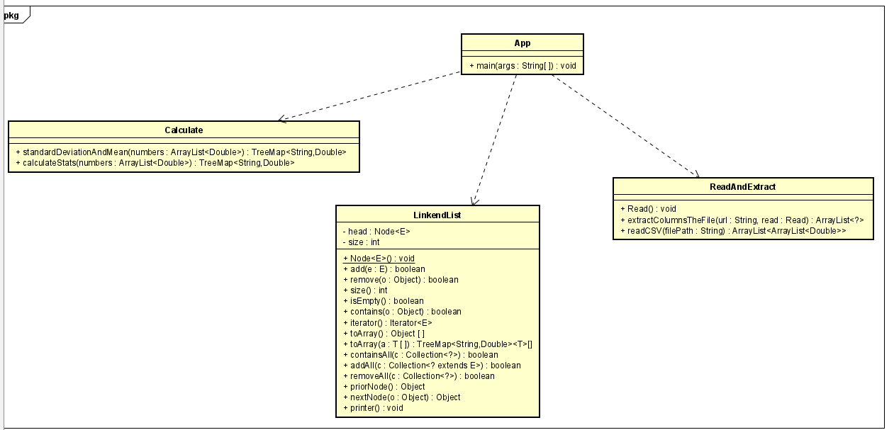

# Mean-SD-Lambda-DataGenerics
Read files the n x m and each column calculate the mean and the standard deviation
[Repository in GitHub here](https://github.com/JffMv/Mean-SD-Lambda-DataGenerics)

In java can count with comments or not, in others files just count rows.


## Getting Started

For clone this repository you use this command:
 ```
 git clone https://github.com/JffMv/Mean-SD-Lambda-DataGenerics.git
 ```

### Prerequisites

Have installed:
maven 3.9.6
[Install Maven](https://maven.apache.org/download.cgi#Installation)


git 2.44
[Install Git](https://git-scm.com/book/en/v2/Getting-Started-Installing-Git)

java
[Install Java](https://www.oracle.com/co/java/technologies/downloads/)


## Running the tests

For Run Test you need the command:

```
 mvn test
```

## Deployment

The process were building project maven with the command:

```
mvn archetype:generate -DgroupId=edu.escuelaing.arsw.ASE.app -DartifactId=Mean-SD-Lambda-DataGenerics -DarchetypeArtifactId=maven-archetype-quickstart -DinteractiveMode=false

```

Then we have verify the class App.java and the pom.xml, run the project with:

```
mvn package
```


For generate documentation update the pom.xml add and later use "mvn package":

```
<reporting>
    <plugins>
    <plugin>
    <groupId>org.apache.maven.plugins</groupId>
    <artifactId>maven-javadoc-plugin</artifactId>
    <version>2.10.1</version>
    <configuration>
    </configuration>
    </plugin>
    </plugins>
</reporting>
```

and the use in order this commands for run documentation:

```
mvn javadoc:javadoc
mvn javadoc:jar
mvn javadoc:aggregate
mvn javadoc:aggregate-jar
mvn javadoc:test-javadoc
mvn javadoc:test-jar
mvn javadoc:test-aggregate
mvn javadoc:test-aggregate-jar
```

if you want see this documentation go to file located


```
...\target\apidocs\index.html

```
Then we start designing the app with the next model:



Run the project seen console with where "Route/you/file.you" put the real location of the file:
```
java -cp target/Mean-SD-Lambda-DataGenerics-1.0-SNAPSHOT.jar edu.escuelaing.arsw.ASE.app.App "Route/you/file.you"

```
and result print the calculates.
For example:
```
The Mean and SD of the column 0 are:
{MEAN=49.13487700000006, SD=28.608851536960895}
The Mean and SD of the column 1 are:
{MEAN=51.32945150000008, SD=27.928344620834892}
The Mean and SD of the column 2 are:
{MEAN=50.125300000000045, SD=28.737282229013925}
The Mean and SD of the column 3 are:
{MEAN=50.16440000000003, SD=27.777828436362732}
The Mean and SD of the column 4 are:
{MEAN=50.456, SD=29.253479519537496}
The Mean and SD of the column 5 are:
{MEAN=51.704703179999996, SD=28.935356969533466

```
## Built With

* [Java](https://www.java.com/es/) - The language used
* [Maven](https://maven.apache.org/) - Dependency Management


## Authors

* **Yeferson Mesa**

## License

This project is licensed under the MIT License - see the [LICENSE.txt](LICENSE.txt) file for details